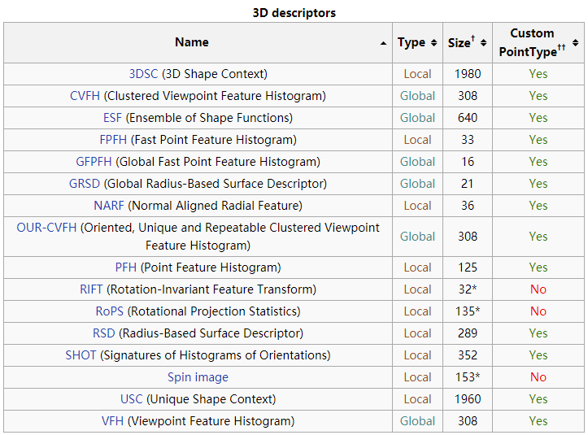

# Learning PCL

记录一下学习PCL过程的代码与参考论文，欢迎提出Issue加入更新。

## Dependence

`c++`，`PCL1.9.0`安装包我放在了共享文件夹[点云库PCL1.9.0](\\192.168.0.92\共享目录\常用软件\软件\点云库PCL1.9.0)

在系统路径Path中加入下载的PCL库文件，类似opencv的方法配置，不需要编译。

```bash
C:\Program Files\PCL 1.9.0\3rdParty\Boost\lib
C:\Program Files\PCL 1.9.0\3rdParty\FLANN\bin
C:\Program Files\PCL 1.9.0\3rdParty\Qhull\bin
C:\Program Files\PCL 1.9.0\3rdParty\VTK\bin
C:\Program Files\PCL 1.9.0\bin
C:\Program Files\OpenNI2\Lib
C:\Program Files\OpenNI2\Redist
C:\Program Files\OpenNI2\Tools
```

环境变量配置完之后，运行demo程序会报系统确实.dll的警告，注销后再开软件就可以正常使用。


## Source

1. 自定义点云

   [生成一个圆柱体demo](LearningPCL/searchpoints.h)

   ```c++
   PointCloudBaseOperate::generatePointCloudShow();
   ```

   

   

2. 最近邻搜索

   [KNeast与flann](LearningPCL/searchpoints.h)

   ```c++
   PointCloudBaseOperate::kNeastSearch();
   PointCloudBaseOperate::kdTreeFlann();
   ```

   定义第0个点位目标点，在目标点附近搜寻30个点。

   

   

3. 可视化

   pcl支持直接在viewer窗体上操作，包含ROI选取。

   

4. 滤波、降采样、表面法向量

   [pointcloudfilter.h](LearningPCL/pointcloudfilter.h)

   

   

5. 特征点

   [ISS、Harris与SIFT](LearningPCL/pointcloudfilter.h)

   - ISS

     全称是Intrinsic shape signatures(内部形状特征)，参考了论文[Intrinsic shape signatures: A shape descriptor for 3D object recognition](https://ieeexplore.ieee.org/document/5457637) 中属于特征点定义的一部分，这也是这几天我在看的一篇，后续会发出来总结。

   - Harris

     是基于2D的一个拓展

   - SIFT

     同样是基于2D的拓展，参考的是这一篇Paper[Distinctive image features from scale-invariant keypoints](https://www.cs.ubc.ca/~lowe/papers/ijcv04.pdf)，使用的是图像固有特征的尺度不变性。(未读)

   

   

   

6. 描述子

   描述子定义了如何描述一个点云特征，如直方图，点对特征......常用于配准、识别、分割 。

   网络上一篇比较详细的讲解在这里==>[OpenNI_tutorial_4:_3D_object_recognition_(descriptors)](http://robotica.unileon.es/index.php/PCL/OpenNI_tutorial_4:_3D_object_recognition_(descriptors))

   一些主流的点云描述子都有在文中介绍，但有一个PPF的方法没介绍。

   

   PCL提供了PFH、FPFH、SHOT的接口。

   [featuredescribes.h](learningPCL/featuredescribes.h)

   PFH的参考文献：[Aligning Point Cloud Views using Persistent Feature Histograms](http://citeseerx.ist.psu.edu/viewdoc/download?doi=10.1.1.391.5915&rep=rep1&type=pdf)

   

7. 深度图

   深度图是从图像采集器到实体物体的距离作为像素值。使用2D图像处理后用于段差、平面度的检测。

   [rangeimage.h](learningPCL/rangeimage.h)

   

   

8. 匹配计算Transformation

   运用上述介绍的基本操作实现两只外形相同，位置不同兔子的关键点匹配。

   [matchdemo.h](learningPCL/matchdemo.h)

   

   

9. 软件开发(Todo)


## Project

### 1、边缘拼接


## Reference

http://www.pclcn.org/study/shownews.php?lang=cn&id=205

